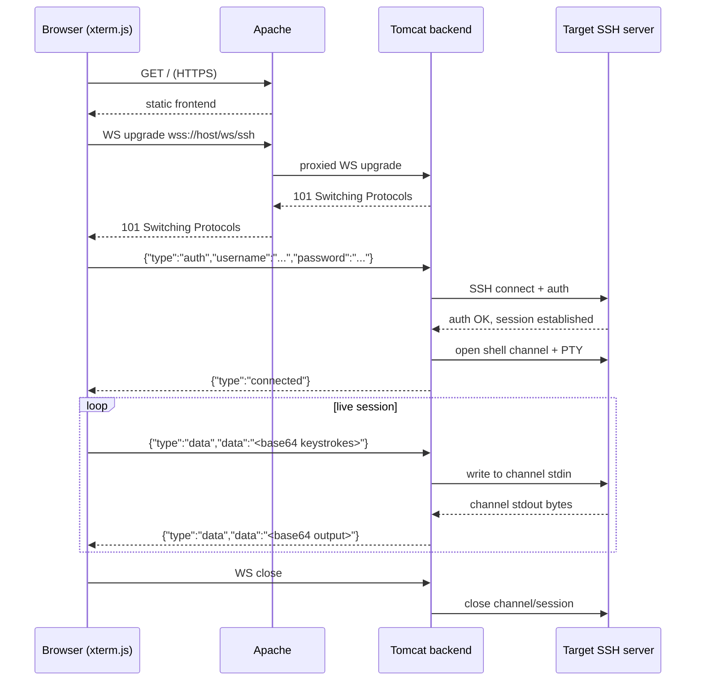

# Architecture

## Goal

Give a browser a live SSH shell to **one specific, server-configured target host**, via three
components: a static JS frontend, an Apache reverse proxy, and a Java backend running on Tomcat
that actually speaks SSH. Nothing else is in scope right now — see [roadmap.md](roadmap.md) for
what's explicitly deferred, and [security.md](security.md) for the constraints that make this
safe to run at all.

## Components

### 1. Frontend (`frontend/`)

- Plain HTML/CSS/JS. No build step, no framework (React/Vue/etc. would be overkill for a
  single-page terminal).
- Terminal rendering via [xterm.js](https://xtermjs.org/) (the same library VS Code, Wetty,
  ttyd, and most other web-terminal projects use), plus the `xterm-addon-fit` addon so the
  terminal resizes to fill its container.
- Responsibilities:
  1. Render a small login form (username + password). The target host/port are **not**
     collected from the user — they're fixed, server-side config (see
     [security.md](security.md)).
  2. On submit, open a WebSocket to `wss://<host>/ws/ssh`.
  3. Send an initial `auth` message (see [api.md](api.md)) containing the submitted credentials.
  4. On `connected`, show the terminal and start piping: keystrokes → outgoing `data` messages;
     incoming `data` messages → written to the terminal.
  5. On terminal resize (window resize, or the fit addon firing), send a `resize` message.
  6. On `error` or WebSocket close, show a clear disconnected/error state and allow retry (a
     fresh WebSocket + re-prompt login — no session resumption in V1).

### 2. Apache reverse proxy (`proxy/`)

Apache is the **only** publicly reachable component. Tomcat's connector binds to `127.0.0.1`
only and is never directly exposed.

Responsibilities:
- TLS termination (`mod_ssl`). Plain HTTP should redirect to HTTPS.
- Serve the static frontend directly (`DocumentRoot` → `frontend/`). Tomcat does not need to
  serve static assets.
- Reverse-proxy `/api/*` to Tomcat over plain HTTP on localhost (`mod_proxy`, `mod_proxy_http`).
- Reverse-proxy the WebSocket upgrade at `/ws/*` to Tomcat (`mod_proxy_wstunnel`).

See [`proxy/sshomcat.conf.example`](../proxy/sshomcat.conf.example) for a working vhost template.

### 3. Backend (`backend/`)

A Java WAR deployed to Tomcat. Target: **Tomcat 10.1.x** (Jakarta EE 10, `jakarta.*`
namespace), **Java 17+**, built with **Maven** (WAR packaging).

Responsibilities:
- `GET /api/health` — trivial liveness check, returns `{"status":"ok"}`.
- `@ServerEndpoint("/ws/ssh")` (Jakarta WebSocket, JSR 356 lineage) — the actual bridge:
  1. On WS open: wait for the client's `auth` message. If nothing valid arrives within a short
     grace period (a few seconds), close the connection — never hold an unauthenticated socket
     open indefinitely.
  2. On receiving `auth {username, password}`: open an outbound SSH connection to the
     configured target (`sshomcat.properties` → `target.host`, `target.port`) using
     **Apache MINA SSHD** as the SSH client library.
  3. On successful SSH auth: allocate a PTY-backed shell channel, send `connected` to the
     browser, and start two bridging loops:
     - SSH channel stdout/stderr → WebSocket `data` messages
     - WebSocket `data` messages → SSH channel stdin
  4. On `resize {cols, rows}`: propagate to the channel's PTY window-change request.
  5. On SSH auth failure or connection error: send `error {message}`, then close the WebSocket.
  6. On WebSocket close (either side) or SSH channel/session termination: tear down the other
     side too. No orphaned sessions.
  7. Enforce an idle timeout and a hard max-session-duration (both configurable), closing the
     bridge if either is exceeded.
- Never logs the password. Holds it in memory only long enough to attempt the SSH auth, then
  discards it.

## Data flow (happy path)

## Technology choices & why

| Layer | Choice | Why |
|---|---|---|
| Terminal rendering | xterm.js + xterm-addon-fit | Industry standard for this exact job; battle-tested, handles ANSI/control sequences correctly. |
| Frontend framework | None (vanilla JS) | Single-purpose page; a framework and build step would be pure overhead for V1. |
| Reverse proxy | Apache httpd (`mod_proxy`, `mod_proxy_wstunnel`, `mod_ssl`) | Fixed project constraint, not really a choice. |
| Backend server | Tomcat 10.1.x | Fixed project constraint. |
| SSH client library | Apache MINA SSHD | Pure Java, actively maintained, an Apache Software Foundation project (fits an Apache-fronted stack), solid PTY/channel support. Preferred over JSch (effectively unmaintained) or sshj (a fine alternative, but MINA SSHD is the more actively developed choice as of this writing). |
| WS message framing | JSON text frames, base64 payload for byte data | Simple, debuggable, framework-agnostic. Binary framing (raw bytes + a 1-byte type prefix, like ttyd uses) is a valid later optimization once correctness is proven — not needed for V1. |
| Build tool (backend) | Maven, WAR packaging | Standard, unambiguous Tomcat deployment story. |

## Explicitly out of scope for now

See [roadmap.md](roadmap.md) for the full phased breakdown, but the headline constraints:

- **One fixed target host/port**, set server-side. The frontend never sends a target host. Do
  not change this without re-reading [security.md](security.md) first — accepting a
  client-supplied target turns this into an open SSH relay.
- One SSH session per browser tab. No session multiplexing, no reconnect/resume.
- Password auth only (relayed straight through to the real SSH server). No private-key auth,
  no MFA, no app-level user database.
- No file transfer, no port forwarding, no multi-host support.
